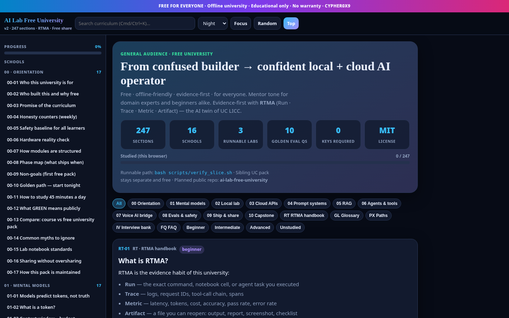

<p align="center">
  
</p>

<h1 align="center">🧠 AI Lab Free University</h1>

<p align="center">
  <strong>A free offline AI campus — built while learning, shared so you learn with less noise</strong><br/>
  Local + cloud · agents · evals · proof habits · open in any full browser
</p>

<p align="center">
  <a href="https://github.com/cipher0x9/ai-lab-free-university-mesmerizing/raw/main/zips/v2-UNIVERSITY.html.zip"></a>
  <a href="https://github.com/cipher0x9/uc-lab-free-university-mesmerizing"></a>
  <a href="https://linktr.ee/cyphermonkey"></a>
  <a href="./LICENSE"></a>
</p>

<p align="center">
  
  
  
  
</p>

<p align="center">
  
  
  
</p>

---

## AI mastery for everyone

This is not only AI for software engineers. It is a universal, proof-driven path
for a student meeting AI for the first time, a career-changer building a new
portfolio, an engineer hardening production systems, a founder testing an idea,
a teacher designing better learning, or a domain expert transferring years of
real-world judgment into a new interface.

Country, credential, hardware budget, and preferred vendor are not admission
requirements. Start with the offline campus and zero-key fixtures; add a local
model or frontier API only when the next experiment needs it.

### Universal truths

| Truth | Practice |
|---|---|
| **Privacy is architecture** | Keep sensitive data local by default; cross a service boundary deliberately. |
| **Models are replaceable** | Put local and frontier models behind measured contracts, not identity or hype. |
| **Agents are privileged workflows** | Type tools, cap loops, trace actions, and approval-gate side effects. |
| **Evals are engineering discipline** | Test quality, latency, cost, safety, and regressions on versioned fixtures. |
| **Proof compounds** | Preserve every Run, Trace, Metric, and Artifact so another learner can reproduce it. |

<p align="center">
  
</p>

---

## ✨ The campus

- One offline single file: `university/v2-UNIVERSITY.html` — **247 sections** across mentor schools (orientation → mental models → local lab → cloud APIs → prompt systems → RAG → agents & tools → voice AI → evals & safety → ship → capstone) · zero CDN
- Themes: Night · Cobalt · Aurora · Slate · Warm · Forest · Focus
- Starter: `university/v1-SLICE.html` — the small Phase-1 golden slice

---

## Why this exists

I am **CYPHER0X9** — long-time **Cisco / UC** engineer, still a humble AI learner-builder.

I got tired of feeling lost between tools, jokes I did not understand, and advice that assumed I already lived in GitHub all day.

So I built a free campus for people like me: curious, practical, evidence-first — not gatekept.

Sibling free campuses:  
🌿 **[UC Lab Free University](https://github.com/cipher0x9/uc-lab-free-university-mesmerizing)** · 🎓 **[Ardham Shastra](https://github.com/cipher0x9/ardham-shastra)**

If this helps even one person walk from confusion to calm practice, it was worth sharing.

---

**All download links:** [DOWNLOADS.md](./DOWNLOADS.md)

## Get it in 60 seconds

### ⭐ Download the campus zip

**→ [v2-UNIVERSITY.html.zip](https://github.com/cipher0x9/ai-lab-free-university-mesmerizing/raw/main/zips/v2-UNIVERSITY.html.zip)**

1. Download  
2. Unzip  
3. Open **`v2-UNIVERSITY.html`** in **Chrome, Safari, Edge, or Firefox**

Offline · No account · No API keys to read the campus  

### How to open

| Device | What to do |
|--------|------------|
| **Laptop / desktop** | Best — unzip → open HTML |
| **Phone / tablet** | **Full Chrome or Safari app only** (not in-app browsers) |
| **iPhone** | Download → **Files** → open HTML in Chrome/Safari |

> Full browser web page by design — not a store app.

---

## What’s inside

| | |
|--|--|
| **Main campus** | `university/v2-UNIVERSITY.html` — 247 sections, themes, schools |
| **Also** | `university/v1-SLICE.html` — Phase-1 golden slice |
| **Zips** | `zips/v2-UNIVERSITY.html.zip` · `zips/v1-SLICE.html.zip` |
| **Grammar** | **RTMA** — Run · Trace · Metric · Artifact |
| **Sibling** | 🌿 UC Lab · **LICC** proof twin |

### RTMA

| Letter | Meaning |
|:--:|--|
| **R** | **Run** — did it execute? |
| **T** | **Trace** — what path did it follow? |
| **M** | **Metric** — what was measured? |
| **A** | **Artifact** — what durable proof remains? |

---

## Clone

```bash
git clone https://github.com/cipher0x9/ai-lab-free-university-mesmerizing.git
cd ai-lab-free-university-mesmerizing
open university/v2-UNIVERSITY.html
```

---

## Sibling — UC Lab Free University

Voice / collaboration / Contact Center · multi-vendor · LICC  

- https://github.com/cipher0x9/uc-lab-free-university-mesmerizing  
- https://github.com/cipher0x9/uc-lab-free-university-mesmerizing/releases/download/v20.2-resources/v17-UNIVERSITY.html.zip  

---

## Safety

Educational only · MIT · no warranty  
Never commit API keys, customer data, or private chats  
No autonomous email/post without a human  
Lab safely · pin official docs for production  

**[HOW-TO-GET.md](./HOW-TO-GET.md)** · **[START-HERE.md](./START-HERE.md)** · **[docs/FAQ.md](./docs/FAQ.md)** · **[SIBLINGS.md](./SIBLINGS.md)**

---

## Author

**CYPHER0X9** · [@cipher0x9](https://github.com/cipher0x9)  
Hub: [linktr.ee/cyphermonkey](https://linktr.ee/cyphermonkey)

<p align="center">
  <strong>Build calmly · Prove carefully · Share freely</strong><br/>
  <em>From outside the room — for everyone still walking in.</em>
</p>
